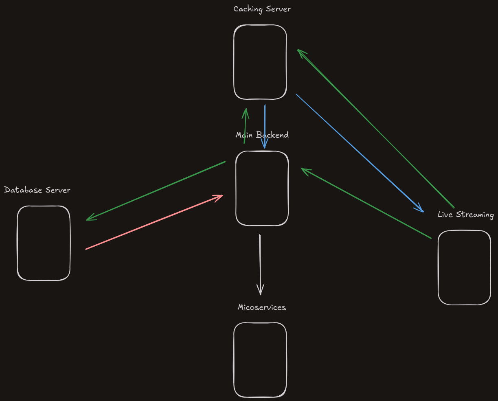

# VTubersTV Technical Specifications Document

## Executive Summary

VTubersTV is an open-source, non-profit streaming platform designed specifically for VTuber content. This document outlines the technical specifications and architecture of the platform, detailing its components, infrastructure, and implementation guidelines.

## 1. System Architecture Overview

VTubersTV implements a distributed microservices architecture optimized for scalability and performance. The system consists of four primary server components, each serving specific functions while maintaining loose coupling for improved maintainability and scalability.

### 1.1 Core Components

1. Main Backend Server
2. Database Server
3. Caching Server
4. Microservices Server

### 1.2 Infrastructure Design



The infrastructure implements bidirectional communication flows between components, with the Main Backend Server acting as the central coordinator.

## 2. Technical Stack

### 2.1 Core Technologies

| Component | Technology | Purpose |
|-----------|------------|----------|
| Runtime | Node.js | Server-side JavaScript execution |
| Framework | Express.js | Web application framework |
| Database | MongoDB | Document-oriented data storage |
| Template Engine | EJS | Server-side rendering |
| Type System | TypeScript | Static typing and enhanced development |

### 2.2 Key Dependencies

#### Security and Authentication
- `bcrypt` (v5.1.1): Password hashing
- `jsonwebtoken` (v9.0.2): JWT implementation
- `helmet` (v8.0.0): HTTP header security
- `express-rate-limit` (v7.4.1): Rate limiting

#### Media and Data Processing
- `fluent-ffmpeg` (v2.1.3): Media processing
- `node-cache` (v5.1.2): Local caching
- `mongoose` (v8.8.3): MongoDB object modeling

#### Frontend and Rendering
- `marked` (v15.0.3): Markdown processing
- `highlight.js` (v11.10.0): Code syntax highlighting
- `ejs` (v3.1.10): Template rendering

## 3. Server Components

### 3.1 Main Backend Server

Primary application server handling:
- Core application logic
- User session management
- Authentication services
- Frontend asset serving
- API routing
- WebSocket connections (via `express-ws`)

### 3.2 Database Server

#### Configuration
- MongoDB instance with local network deployment
- Mongoose schema implementation
- Redundancy through replica sets
- Regular backup scheduling

#### Naming Convention
Database servers follow a specific naming convention:
- Primary: `lynx.db.vtubers.tv`
- Secondary: `sora.db.vtubers.tv`

### 3.3 Caching Server

Implements distributed caching with:
- In-memory data storage
- Cache invalidation strategies
- Automatic cache cleanup
- Cache statistics monitoring

### 3.4 Microservices Server

Handles specialized tasks including:
- Machine learning operations
- Background job processing
- Scheduled task execution via `node-cron`
- Service isolation and scaling

## 4. Security Implementation

### 4.1 Security Features

#### Authentication and Authorization
- JWT-based authentication
- Session management
- Password hashing with bcrypt
- Role-based access control

#### Network Security
- CORS protection
- Rate limiting
- Helmet security headers
- GeoIP tracking for legal compliance

#### Data Protection
- Encrypted sessions
- Secure cookie handling
- Input validation via zod
- XSS protection

## 5. Development Workflow

### 5.1 Build Process

```bash
# Install dependencies
npm install

# Run build pipeline
npm run build
npm run tsc
npm run preprocess

# Start development server
npm run dev
```

### 5.2 Development Tools

- Code Formatting: Prettier
- Type Checking: TypeScript
- Dependency Management: Custom audit scripts
- Testing: Automated test suite

## 6. Performance Optimization

### 6.1 Caching Strategy

- Distributed caching layer
- Content delivery optimization
- Database query caching
- Asset caching

### 6.2 Code Optimization

- Minification via terser
- Tree shaking
- Dead code elimination
- Bundle optimization

## 7. Monitoring and Maintenance

### 7.1 System Monitoring

- Performance metrics tracking
- Error logging and reporting
- Resource usage monitoring
- Security audit logging

### 7.2 Maintenance Procedures

- Automated dependency updates
- Regular security patches
- Database maintenance
- Backup verification

## 8. Licensing and Distribution

- License: GPL-3.0
- Repository: Public GitHub
- Development: Community-driven
- Structure: Non-profit

## References

1. Express.js Documentation: https://expressjs.com/
2. MongoDB Documentation: https://www.mongodb.com/docs/
3. TypeScript Handbook: https://www.typescriptlang.org/docs/
4. Microservices Architecture: https://microservices.io/
5. Node.js Best Practices: https://nodejs.org/en/docs/guides/
6. WebSocket Protocol: https://datatracker.ietf.org/doc/html/rfc6455

## Version History

| Version | Date | Description |
|---------|------|-------------|
| 1.0.0 | 12/14/2024 11:23:17 AM | Initial specification document |
|

---

This specification is maintained by the VTubersTV development team and is subject to updates and modifications as the project evolves.
