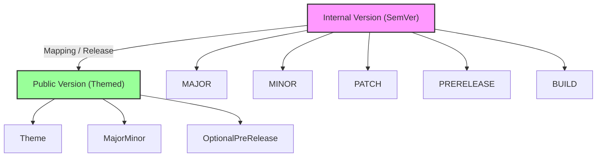

# Versioning Guidelines

## Overview

This document outlines the versioning strategy for VTubers.TV, covering both internal and public-facing versions. It ensures clarity, consistency, proper tracking of development progress, and clear communication with contributors and the community.

---

## Internal Versioning

VTubers.TV uses **Semantic Versioning (SemVer)** for internal development to track features, bug fixes, and releases.

### Format

`MAJOR.MINOR.PATCH[-PRERELEASE][+BUILD]`

### Components

* **MAJOR**: Breaking changes or incompatible API modifications.
* **MINOR**: New features that are backwards-compatible.
* **PATCH**: Bug fixes and minor improvements.
* **PRERELEASE**: Optional pre-release tags (e.g., `alpha`, `beta`, `rc.1`).
* **BUILD**: Optional build metadata for internal tracking.

### Examples

* Standard: `1.0.0`
* Pre-release: `1.0.0-alpha.1`
* Build metadata: `1.0.0+build123`

### Best Practices

* Increment **PATCH** for bug fixes and documentation updates.
* Increment **MINOR** when adding new features in a backwards-compatible way.
* Increment **MAJOR** only for breaking changes.
* Use pre-release tags for alpha, beta, or release candidates before official release.
* Include build metadata for CI/CD pipelines, nightly builds, or internal testing.

---

## Public Versioning

Public versions are **simplified and branded** for the community, focusing on major milestones.

### Format

`<Theme>-<Major.Minor>`

### Components

* **Theme**: Represents the release theme or name (e.g., `Aurora`, `Nebula`).
* **Major.Minor**: Tracks significant and minor releases for the community.
* Optional suffix for pre-releases (e.g., `-beta`).

### Examples

* `Aurora-1.1`
* `Nebula-2.0-beta`

### Best Practices

* Choose **memorable themes** for major releases that align with marketing or platform updates.
* Maintain a simple **Major.Minor** format for community clarity.
* Use public pre-release suffixes to indicate beta or experimental versions.
* Align internal version numbers with public versions to maintain traceability.

---

## Version Mapping

* Internal MAJOR.MINOR.PATCH maps to Public `<Theme>-Major.Minor` for each release.
* Pre-releases internally can correspond to public beta releases.
* Build metadata is strictly internal and never shown in public versions.

---

## Communication and Release Notes

* Each release, whether internal or public, should include **release notes** documenting changes, fixes, and features.
* Public release notes should be concise, highlighting key features and improvements.
* Internal release notes should include full technical details for contributors.
* Versioning should be included in all CI/CD pipelines, changelogs, and documentation.

---

## Key Principles

* **Consistency**: Both internal and public versions follow predictable, easy-to-understand rules.
* **Transparency**: Version numbers reflect real development progress and maintain traceability.
* **Community-Friendly**: Public versions emphasize readability and engagement.
* **Traceability**: Every public release can be traced back to an internal version for debugging or reference.
* **Scalability**: Versioning system supports multiple concurrent releases, pre-releases, and patches.

---

## Diagram

